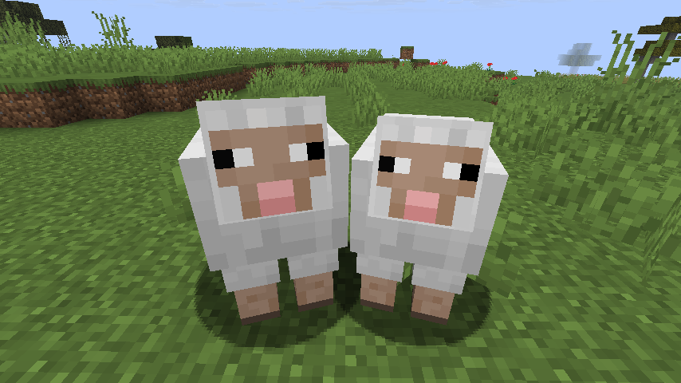
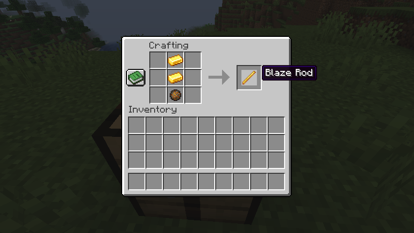
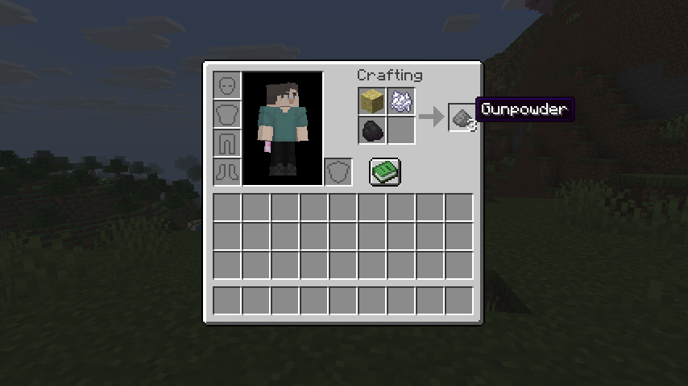
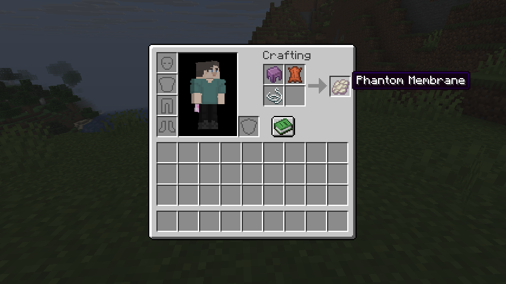
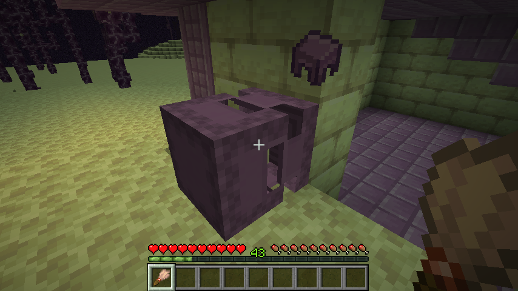

# 🧽 CleanedCraft

**Strip away the chaos, keep the challenge.**

A Fabric mod that redefines vanilla survival by removing hostile and magic elements. Perfect for players who love minimalistic building and adventure but don't want the game to have battles and magic.

---

## 🛠️ Technical Details
- **Supported Minecraft versions:** `26.2`, `26.3`
- **Mod Loader:** Fabric
- **Fabric Loader:** `0.19.5`
- **Fabric API:** `0.160.6+26.3`(for `26.3`) or `0.160.0+26.2`(for `26.2`)

---

## ✨ What's Changed

### ❌ Removed Content
| Category           | What's Gone                                                      |
|:-------------------|:-----------------------------------------------------------------|
| **Hostile Mobs**   | Creepers, zombies, skeletons, and all other aggressive creatures |
| **Weapons**        | Swords, spears, arrows, crossbow, mace                           |
| **Enchanting**     | Enchanting table, enchanted books, anvil enchanting              |
| **Potion brewing** | Brewing stand, potions                                           |

### ➕ New Additions
| Feature                     | Description                                                                                                                                                                    |
|:----------------------------|:-------------------------------------------------------------------------------------------------------------------------------------------------------------------------------|
| **🐄 Gender System**        | Animals and villagers now have male and female variants (the female variants little bit smaller in size). **Right-click** any creature with a **compass** to check its gender. |
| **📐 New crafts**           | Added recipes for string, blaze rod, gunpowder and phantom membrane.                                                                                                           |
| **🧹 Brushing on shulkers** | Use brush on shulkers to get **shulker shell**.                                                                                                                                |

### 🕊️ Peaceful Mobs
The following mobs are now completely **neutral and peaceful**:
- **🕷️ Spiders** — no longer attack at night or in darkness. They just roam around.
- **🐻 Polar Bears** — now passive and won't attack when approached.
- **🪨 Silverfishes** — no longer attack players.
- **🐷 Piglins and Hoglins** — are peaceful.
- **🟪 Shulkers** — no attack players anymore.
---

## 📸 Features Preview

| Feature                                                     | Screenshot                                                                           |
|:------------------------------------------------------------|:-------------------------------------------------------------------------------------|
| **Gender Display** (right-click with compass)               |                            |
| **Difference in size** between male and female variants     |  |
| **String** from cobweb                                      |                            |
| **Blaze rod** from two golden ingots and fire charge        |                                      |
| **Gunpowder** from sulfur, coal and bone meal               |                                      |
| **Phantom membrane** from shulker shell, leather and string |                               |
| **Shulkers** can be brushed                                 |                                     |
---

## ⚙️ Installation

1. Install **Fabric Loader** for Minecraft.
2. Download **Fabric API** and place it in your `mods` folder.
3. Place this mod's `.jar` file for your Minecraft version in the same folder.
4. Launch the game and enjoy!

---

## 🎯 Why This Mod?

This mod shifts the focus from battles and magic to **exploration and survival**. Nights are no longer terrifying. It's a cleaner, more peaceful Minecraft — but still rewarding.

---

## 📜 License

This project is licensed under the **MIT License** — you're free to use, modify, and distribute it for any purpose, provided you include the original copyright notice.

---

## 🏷️ Disclaimer

Minecraft is a trademark of Mojang AB. This mod is not affiliated with, endorsed by, or sponsored by Mojang or Microsoft. All rights to the original game belong to their respective owners.
